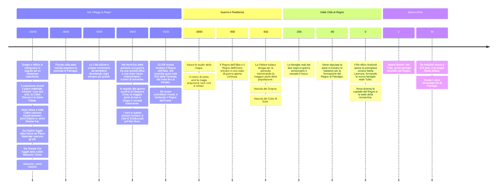

## - 15000
[[Drago|Draghi]] e [[Nifilim]] si estinguono in seguito ad un [[Estinzione dei Draghi e dei Nifilim|misterioso cataclisma]]. In seguito all'energia rilasciata durante questo evento, la [[Trama]] e il [[Piano Materiale]] vengono fortemente scossi. Da quest'ultimo nascono due echi intrisi di un enorme quantità di magia: la [[Selva Fatata]] e la [[Coltre Oscura]].

Nel Piano Materiale e nei suoi echi, cominciano a nascere i primi umanoidi.
Gli [[Umani]] nel Piano Materiale, gli [[Eladrin]] nella Selva, e gli [[Shadar-kai]] nella Coltre. 

In seguito, alcuni Eladrin, in cerca di un posto più tranquillo, decidono di trasferirsi nel Piano Materiale. Negli anni, la lontananza dalla magia fatata della Selva, li ha resi più ferali e meno magici, diventando [[Elfi]].

Similmente, alcuni Shadar-kai si trasferiscono nel Piano Materiale, nel tempo diventeranno i [[Drow]].

## -9000
In questo periodo la penisola è popolata da insediamenti che vanno dai villaggi a città-stato, perlopiù razziali, spesso arroccate intorno a rovine Niflim, che forniscono supporto e riparo alle città. 

## -6000
In questo periodo città umane ed elfiche raggiungono uno sviluppo e un'estensione non indifferente. Le altre razze sono solitamente accettate, seppur non ben viste, da entrambi i popoli. Iniziano anche delle vere e proprie guerre territoriali, che rendono difficile ricostruire i confini dell'epoca.

# -5800
A Nord-Est di Patriagis, vicino a dove ora sorge la città di [[Tronh]], avviene la più grande battaglia del periodo: La [[Battaglia del Crepuscolo]], che termina la guerra tra una società elfica e una drow della zona. 
È considerata una delle più catastrofiche battaglie, in termini di vite perse, della storia, ed è comunemente considerata una delle principali cause della quasi estinzione della razza elfica è oggi così rara. Una delle conseguenze della battaglia e della fine di questa guerra è la [[Battaglia del Crepuscolo#Conseguenze La Diaspora Drow|Diaspora Drow]]. Il popolo drow, sconfitto e decimato, si disperde per la penisola: alcuni, ricchi e benestanti, riescono a comprarsi titoli nobiliari presso la società elfica vincente, che diventerà il [[Regno dell’Alba]], altri si rifugiano in reti di caverne sotterranee dell'[[Alto Muro]], altri ancora salpano per la regione di [[Garoth-Mùk]].

In questo stesso periodo, i Nani che vivono nel nord-ovest della penisola fondano [[Zubduzurak]], la prima città dei Signori dei Picchi, che preso si allargherà e colonizzerà i migliori picchi dell'Alto Muro. 

## -5500
Dopo la fine della Battaglia del Crepuscolo, gli elfi della parte est di Patriagis, dai [[Pendici]], fino al [[Mare Stretto]], fondano un enorme regno chiamato [[Regno dell’Alba]], o *Aranië*, in elfico. 

Spinti dalla paura del nuovo e portentoso regno elfico a est, gli umani delle città a ovest dei Pendici, si unificano sotto il [[Regno dell'Ovest]].

