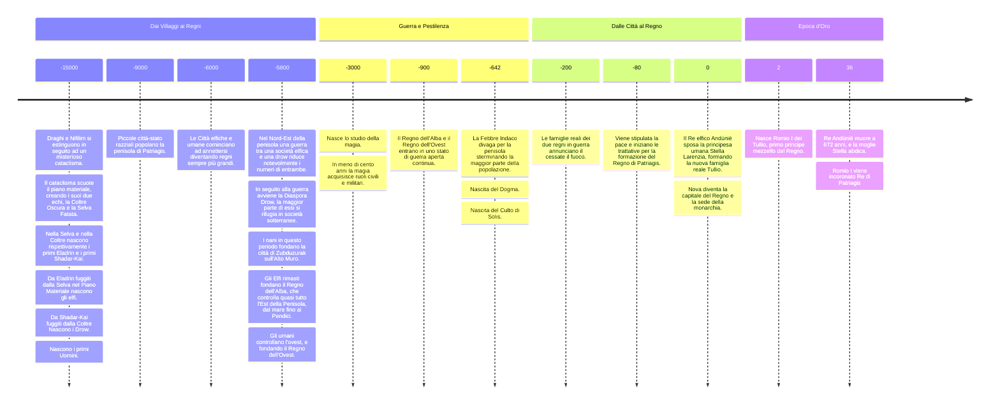

```mermaid
timeline
        title   
        section Dai Villaggi ai Regni
        -15000 : Draghi e Nifilim si estinguono in seguito ad un misterioso cataclisma.
			    : Il cataclisma scuote il piano materiale, creando i suoi due echi, la Coltre Oscura e la Selva  Fatata.
				: Nella Selva e nella Coltre nascono rispettivamente i primi Eladrin e i primi Shadar-Kai.
				: Da Eladrin fuggiti dalla Selva nel Piano Materiale nascono gli elfi.
				: Da Shadar-Kai fuggiti dalla Coltre Nascono i Drow.
				: Nascono i primi Uomini. 	
		-9000: Piccole città-stato razziali popolano la penisola di Patriagis. 
		-6000: Le Città elfiche e umane cominciano ad annettersi diventando regni sempre più grandi.
		-5800: Nel Nord-Est della penisola una guerra tra una società elfica e una drow riduce notevolmente i numeri di entrambe.
			: In seguito alla guerra avviene la Diaspora Drow, la maggior parte di essi si rifugia in società sotterranee. 
			: I nani in questo periodo fondano la città di Zubduzurak sull'Alto Muro. 
			: Gli Elfi rimasti fondano il Regno dell'Alba, che controlla quasi tutto l'Est della Penisola, dal mare fino ai Pendici. 
			: Gli umani controllano l'ovest, e fondando il Regno dell'Ovest.
        section Guerra e Pestilenza
        -3000: Nasce lo studio della magia.
			: In meno di cento anni la magia acquisisce ruoli civili e militari.
        -900: Il Regno dell'Alba e il Regno dell'Ovest entrano in uno stato di guerra aperta continua.
        -642: La Febbre Indaco divaga per la penisola sterminando la maggior parte della popolazione.
	        : Nascita del Dogma.
	        : Nascita del Culto di Solis.
	    section Dalle Città al Regno
		-200: Le famiglie reali dei due regni in guerra annunciano il cessate il fuoco.
		-80: Viene stipulata la pace e iniziano le trattative per la formazione del Regno di Patriagis.
		0: Il Re elfico Andúnië sposa la principesa umana Stella Larenzia, formando la nuova famiglia reale Tullio. 
			: Nova diventa la capitale del Regno e la sede della monarchia.
	    section Epoca d'Oro
		2: Nasce Romio I dei Tullio, primo principe mezzelfo del Regno.
		36: Re Andúnië muore a 672 anni, e la moglie Stella abdica. 
			: Romio I viene incoronato Re di Patriagis

```
