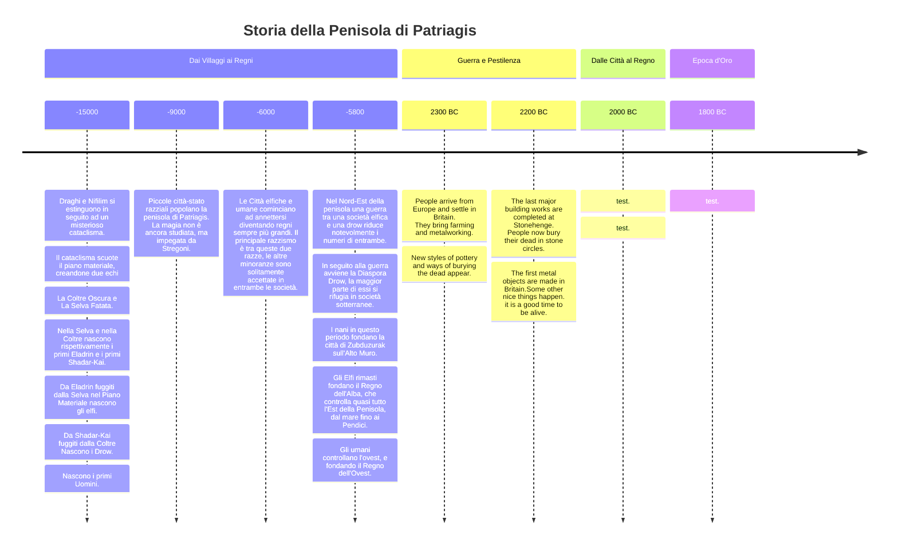

```mermaid
timeline
        title Storia della Penisola di Patriagis
        section Dai Villaggi ai Regni
        -15000 : Draghi e Nifilim si estinguono in seguito ad un misterioso cataclisma.
			    : Il cataclisma scuote il piano materiale, creandone due echi: La Coltre Oscura e La Selva  Fatata.
				: Nella Selva e nella Coltre nascono rispettivamente i primi Eladrin e i primi Shadar-Kai.
				: Da Eladrin fuggiti dalla Selva nel Piano Materiale nascono gli elfi.
				: Da Shadar-Kai fuggiti dalla Coltre Nascono i Drow.
				: Nascono i primi Uomini. 	
		-9000: Piccole città-stato razziali popolano la penisola di Patriagis. La magia non è ancora studiata, ma impegata da Stregoni.
		-6000: Le Città elfiche e umane cominciano ad annettersi diventando regni sempre più grandi. Il principale razzismo è tra queste due razze, le altre minoranze sono solitamente accettate in entrambe le società. 
		-5800: Nel Nord-Est della penisola una guerra tra una società elfica e una drow riduce notevolmente i numeri di entrambe.
			: In seguito alla guerra avviene la Diaspora Drow, la maggior parte di essi si rifugia in società sotterranee. 
			: I nani in questo periodo fondano la città di Zubduzurak sull'Alto Muro. 
			: Gli Elfi rimasti fondano il Regno dell'Alba, che controlla quasi tutto l'Est della Penisola, dal mare fino ai Pendici. 
			: Gli umani controllano l'ovest, e fondando il Regno dell'Ovest.
        section Guerra e Pestilenza
          2300 BC : People arrive from Europe and settle in Britain. <br>They bring farming and metalworking.
                  : New styles of pottery and ways of burying the dead appear.
          2200 BC : The last major building works are completed at Stonehenge.<br> People now bury their dead in stone circles.
                  : The first metal objects are made in Britain.Some other nice things happen. it is a good time to be alive.
	    section Dalle Città al Regno
			2000 BC : test.
					: test.	    
	    section Epoca d'Oro
			1800 BC : test.
```

> [!timeline|red] Title
> Lorem, ipsum dolor sit amet consectetur, adipisicing elit.

