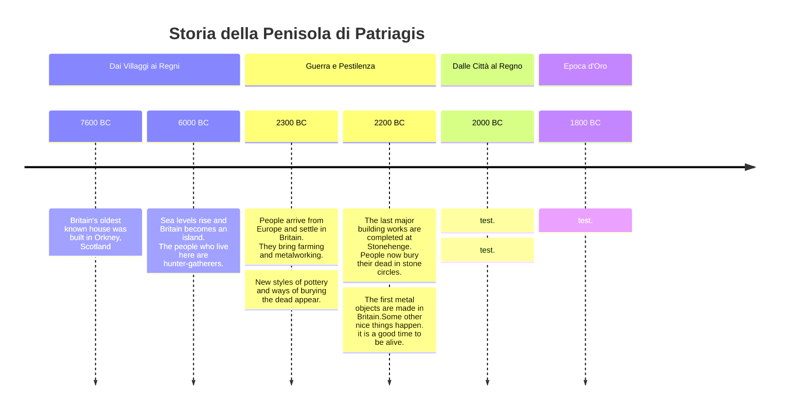

```mermaid
timeline
        title Storia della Penisola di Patriagis
        section Dai Villaggi ai Regni
          7600 BC : Britain's oldest known house was built in Orkney, Scotland
          6000 BC : Sea levels rise and Britain becomes an island.<br> The people who live here are hunter-gatherers.
        section Guerra e Pestilenza
          2300 BC : People arrive from Europe and settle in Britain. <br>They bring farming and metalworking.
                  : New styles of pottery and ways of burying the dead appear.
          2200 BC : The last major building works are completed at Stonehenge.<br> People now bury their dead in stone circles.
                  : The first metal objects are made in Britain.Some other nice things happen. it is a good time to be alive.
	    section Dalle Città al Regno
			2000 BC : test.
					: test.	    
	    section Epoca d'Oro
			1800 BC : test.
```

