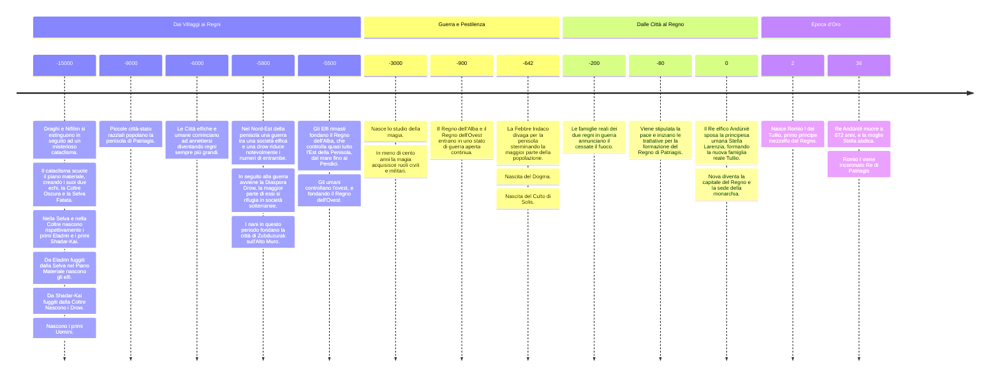

#evento 

## -9000

In questo periodo la penisola è popolata da insediamenti che vanno dai villaggi a città-stato, perlopiù razziali, spesso arroccate intorno a rovine [[Nifilim]], che forniscono supporto e riparo alle città. 

## -6000

In questo periodo città umane ed elfiche raggiungono uno sviluppo e un'estensione non indifferente. Le altre razze sono solitamente accettate, seppur non ben viste, da entrambi i popoli. Iniziano anche delle vere e proprie guerre territoriali, che rendono difficile ricostruire i confini dell'epoca.

## -5800

A Nord-Est di Patriagis, vicino a dove ora sorge la città di [[Tronh]], avviene la più grande battaglia del periodo: La [[Battaglia del Crepuscolo]], che termina la guerra tra il popolo elfico degli [[Ëarwaith]] e quello dei [[Linnor]]. 
È considerata una delle più catastrofiche battaglie, in termini di vite perse, della storia, ed è comunemente considerata una delle principali cause della quasi estinzione della razza elfica è oggi così rara. In seguito alla battaglia i superstiti furono costretti a collaborare e fu fondata la città di [[Tronh]]. 

In questo stesso periodo, i Nani che vivono nel nord-ovest della penisola fondano [[Zubduzurak]], la prima città dei Signori dei Picchi, che preso si allargherà e colonizzerà i migliori picchi dell'Alto Muro. 

## -5500

Dopo la fine della Battaglia del Crepuscolo, gli elfi della parte est di Patriagis, dai [[Pendici]], fino al [[Mare Stretto]], fondano un enorme regno chiamato [[Regno dell’Alba]], o *Aranië*, in elfico. 

Spinti dalla paura del nuovo e portentoso regno elfico a est, gli umani delle città a ovest dei Pendici, si unificano sotto il [[Regno dell'Ovest]].

## -3000

Fino a questo periodo, la magia era usata in maniera istintiva da individui capaci di connettersi naturalmente alla [[Scintilla]]. Stregoni, Bardi, Druidi e Chierici erano visti come fattucchieri dotati di potere, e spesso, specialmente nelle parti più rurali della penisola, visti come profeti o messia. 
Intorno a questo anno però, si inizia a comprendere meglio il funzionamento della magia e della trama, e inizia a venire usata per scopi civili e militari.

## -900

Il [[Regno dell’Alba]] e il [[Regno dell'Ovest]] entrano in uno stato di guerra aperta e continua per motivi di espansione. La guerra consiste principalmente in schermaglie lungo i [[Pendici]], dove però nessuno dei due regni sembra avanzare. L'ammontare dei morti è ignoto, ma si crede che sia nell'ordine delle decine di migliaia per tutta la durata della guerra. 

La guerra prosegue per più di 300 anni e stanca velocemente entrambi i popoli, ciononostante le famiglie reali dei regni non sembrano voler firmare un armistizio. 

## -642

In questo anno colpisce la penisola la terribile [[Febbre Indaco]]. L'epidemia divaga velocemente dal [[Regno dell'Ovest]] al [[Regno dell’Alba]], sterminando decine di migliaia di persone. 

I nani di [[Zubduzurak]] riescono, grazie alla loro posizione e a una repentina chiusura dei loro contatti con il mondo esterno, ad uscire illesi dall'epidemia.

In questo periodo nasce il culto di [[Solis]], formalizzato poi nella [[Chiesa di Solis]]. Nello stesso periodo, nasce anche il [[Dogma]], una delle religioni più influenti della penisola.

Durante la pestilenza, sia il Regno dell'Ovest che quello dell'Alba, iniziano a frammentarsi e dividersi internamente. Ogni villaggio e città pensa a sé stesso, creando tante piccole città stato.

A Est dei Pendici, nel Regno dell'Alba la situazione è particolarmente tragica: la popolazione elfica, che non si è mai ripresa dalla [[Battaglia del Crepuscolo]] a causa della lentezza con la quale si riproduce, è decimata dalla guerra e dalla pestilenza ed è ridotta a una decina di migliaia di individui. 

Molte delle città elfiche del regno vengono abbandonate, e l'unico centro abitato ancora di dimensioni notevoli è [[Arum]], capitale del Regno dell'Alba. 

## -400

Intorno a questo periodo, la maggior parte della popolazione vive in città stato sparse per la regione, senza alcuna lealtà od obbligo verso le famiglie reali del [[Regno dell’Alba]] e del [[Regno dell'Ovest]]. 

Le città combattono tra di loro per territorio e per risorse, ma sviluppano anche legami commerciali e militari. Specialmente le città intorno ai [[Pendici]], indifferenti alla loro precedente appartenenza ai due regni, iniziano a collaborare data la loro vicinanza. 

Nel giro di tre generazioni, la demografia di queste città cambia: 
* a ovest, la popolazione elfica e la successiva popolazione mezzelfa, si mescola con gli umani locali; 
* A est invece, molte famiglie di umani partono per ripopolare le città elfiche abbandonate o semi-abbandonate dopo la pestilenza. Mescolandosi con i locali rimasti, queste città diventano velocemente a maggioranza mezzelfa, portando lentamente all'estinzione gli elfi purosangue rimasti. 

Persino la capitale del [[Regno dell’Alba]], [[Arum]], intorno al -240 è a maggioranza mezzelfa. 

## -200

In questi anni, i nani di [[Zubduzurak]] fanno forte pressioni alle famiglie reali del [[Regno dell’Alba]] e del [[Regno dell'Ovest]] per porre fine ufficialmente alla [[Guerra dei due Regni]], che comunque non viene più seriamente combattuta dal almeno 400 anni. 

I nani vogliono una Patriagis unita sotto un'unica nazione: nuove sfide arrivano da fuori la penisola, e ci vuole una nazione forte e unita per combatterle. 

Ci vorranno comunque quasi 120 anni di trattative prima di ottenere un accordo che metta d'accordo tutte le città stato e le famiglie reali di Patragis coinvolte. 

## -80

Il [[Regno dell’Alba]] e il [[Regno dell'Ovest]] firmano la pace, dando fine alla [[Guerra dei due Regni]]. 
Iniziano subito le trattative per la formazione di un unico Regno, che rappresenti tutta Patriagis. 

## 0

Viene ufficialmente fondato il [[Regno di Patriagis]], sposando il Re elfico [[Andúnië]] e la principessa umana [[Stella Larenzia]], creando la nuova famiglia reale [[Tullio]]. 

Le città stato, accettano di entrare a far parte del Regno, mantenendo però forti autonomie. Ogni città infatti avrà un capo locale, il [[Sindaco]] che amministra la città insieme al [[Consiglio del Comune]]. Inoltre, avrà un esercito locale, al cui comando è posto un'altra figura elettiva chiamata [[Capitano del Popolo]].

Inoltre, un rappresentante della famiglia reale, il re o la regina, ha potere esecutivo, e perciò da indirizzo alla nazione e propone nuove leggi o la modifica di quelle esistenti. Ma solo il [[Regio Consiglio]], ha il potere legislativo, ed è formato da due rappresentati di ogni città. 

Inoltre, ogni questione che abbia a che fare con la magia, è delegata ad un ministero fortemente indipendente, chiamato [[Consiglio Arcano di Patriagis]]. 

La capitale del regno viene posta a [[Nova]], dove la famiglia reale risiede. 

## 2

Nasce [[Romio I]], il primo mezzelfo membro della famiglia reale [[Tullio]].

## 36
Re [[Andúnië]] muore all'età di 672 anni; la moglie Regina [[Stella Larenzia]] abdica in favore del figlio Re [[Romio I]], primo Re mezzelfo della famiglia [[Tullio]].

Questo viene socialmente considerato il vero punto di inizio del [[Regno di Patriagis]], che si lascia alle spalle il passato fatto di violenza razziale e abbraccia il futuro. Inoltre, le vecchie famiglie reali, rappresentate da [[Andúnië]] e da [[Stella Larenzia|Stella]], erano considerate ancorate al passato e non più rappresentative di una popolazione che aveva ormai abbracciato un vita non più legata a questioni di razza. 
La popolazione di Patriagis infatti andando avanti di generazione in generazione è sempre più mezzelfa, sempre meno umana, e con poche migliaia di elfi purosangue ancora in vita. Le città sono fortemente diventate fortemente multiculturali e il razzismo è visto come un retaggio del passato.

## 40
È in questo clima che vari popoli come i [[Tiarna na Madraì]] e i [[Tritoni]], decidono di far sentire la loro voce.

Durante la formazione del [[Regno di Patriagis]], tutti i territori della penisola sono stati considerati di proprietà del regno. Questo però comprende molti territori che non sono mai appartenuti né a [[Zubduzurak]], né al [[Regno dell’Alba]], né al [[Regno dell'Ovest]], né tanto meno a qualche città stato parte delle trattative. 

Il [[Regno di Ceneria]], [[Seormgrà]] la capitale dei [[Tiarna na Madraì|Tiarna]], [[Ta-Peara]] la città-perla dei Tritoni, capitale della [[Repubblica di Nén]], e molte altre con loro, si uniscono in un alleanza per chiedere pacificamente al [[Regno di Patriagis|Regno]], di lasciare i loro territori sulla penisola.

L'alleanza, conosciuta come [[Popoli Liberi di Patriagis]], ottiene molti sostenitori anche tra gli abitanti del regno, che chiedono a gran voce a Re [[Romio I]] di lasciare ai popoli indigeni della penisola i loro territori ancestrali.

Re Romio I annuncia quindi un consiglio speciale, dove il Re, i Sindaci di tutta Patriagis, e un rappresentante per ognuno di questi popoli tratteranno la questione.

## 41
A seguito del [[Gran Consiglio Speciale per i Popoli Liberi]], Re [[Romio I]] annuncia che ai [[Popoli Liberi di Patriagis]] viene concessa la custodia dei territori del Regno nel quale hanno sempre abitato. Essi potranno abitare e trasformare il territorio a loro concesso a proprio piacimento. Il Regno si impegna anche a non usufruire di questi terreni, se non previo accordo. 
I cittadini dei Popoli Liberi sono inoltre riconosciuti come cittadini del [[Regno di Patriagis|Regno]]. A garanzia di rispetto della loro cultura, i villaggi e le città dei Popoli Liberi non devono rispettare la normale struttura dei [[Comune|comuni]] della nazione. Viene inoltre loro concessa rappresentanza presso il [[Regio Consiglio]].
I cittadini e le città dei Popoli Liberi hanno però gli stessi doveri dei normali cittadini e dei comuni, tra i quali il pagamento delle tasse reali e l'obbligo di difesa del Regno in caso di necessità. 

Inoltre, ogni popolo ha diritto ad un rappresentante presso il [[Popoli Liberi di Patriagis#Consiglio dei Popoli Liberi|Consiglio dei Popoli Liberi]], un organo specificatamente creato a garanzia del rispetto dell'accordo e che tratta materie di salvaguardia e sviluppo di questi popoli con sede a [[Nova]].

